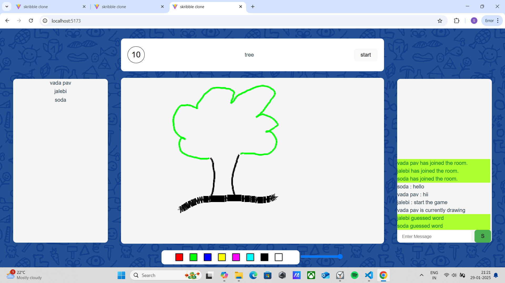
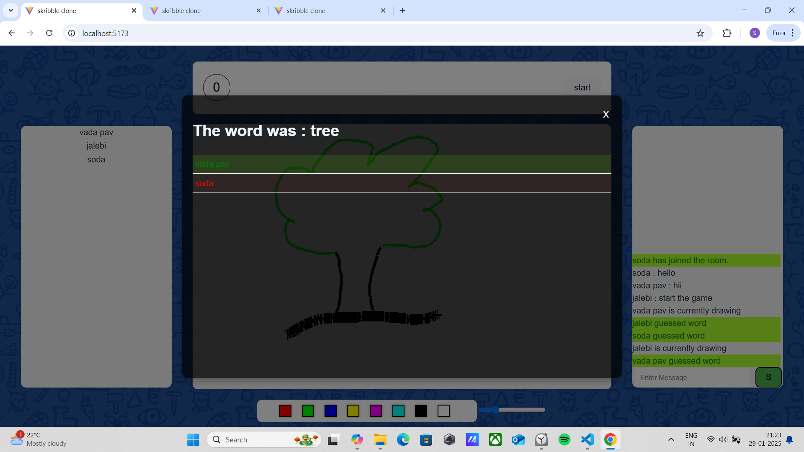

# Skribbl.ioClone

A multiplayer online drawing and guessing game, inspired by Skribbl.io, built using FastAPI, Socket.IO, and React.




Table of Contents

1.[Overview](#Overview)

2.[Features](#Features)

3.[Installation](#Installation)

4.[Usage](#Usage)

5.[Contributing](#Usage)

6.[License](#License)

7.[Contact](#Contact)

## Overview

This project is a clone of Skribbl.io, a popular drawing and guessing game. Users can create or join a room, and once the game starts, one player is selected to draw a word while the others need to guess it within a given time frame. Players can also chat within the room, making it a fun and interactive experience.

## Features

Create or join game rooms

Real-time drawing and guessing

In-room chat functionality

Built with FastAPI for the backend

Socket.IO for real-time communication

React for the frontend

## Installation

To run this project locally, follow these steps:

Clone the repository:

```bash
git clone https://github.com/SiddharamTalawar/Skribble-clone.git
cd skribbio-clone
```

Set up the backend:

```bash
cd backend
python -m venv venv
source venv/bin/activate # On Windows, use `venv\Scripts\activate`
pip install -r requirements.txt
uvicorn main:app --reload
```

Set up the frontend:

```bash
cd ../frontend
npm install
npm start
```

## Usage

To start the game:

Run the backend server:

```bash
cd backend
source venv/bin/activate # On Windows, use `venv\Scripts\activate`
uvicorn main:app --reload
```

Start the frontend server:

```bash
cd ../frontend
npm start
```

Open your browser and go to http://localhost:5173 to access the game.

## Contributing

Contributions are welcome! Please follow these steps to contribute:

Fork the repository

Create a new branch (git checkout -b feature-branch)

Make your changes

Commit your changes (git commit -m 'Add new feature')

Push to the branch (git push origin feature-branch)

Open a Pull Request

## License

This project is licensed under the MIT License.

## Contact

For any questions or feedback, please reach out to:

Siddhu Talawar - siddhu.dev822@gmail.com

```

```
